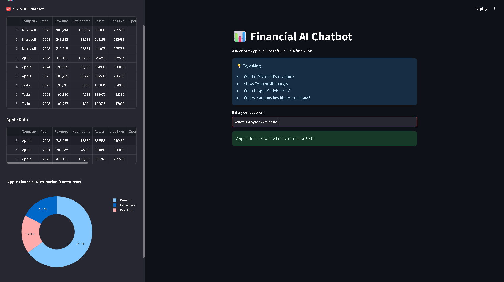
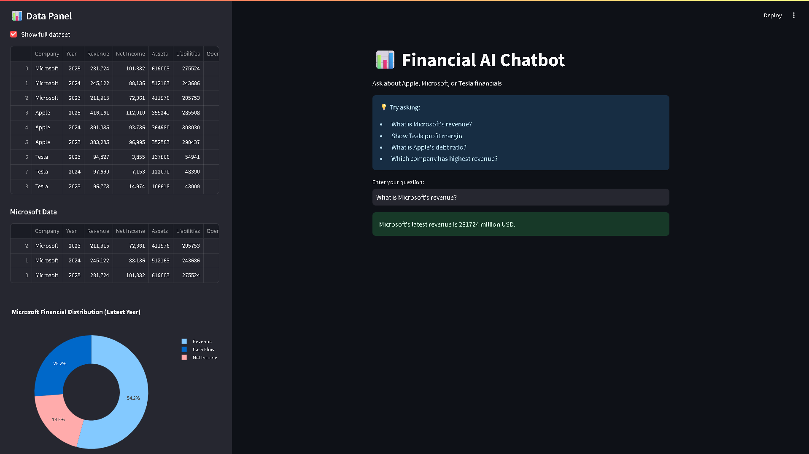
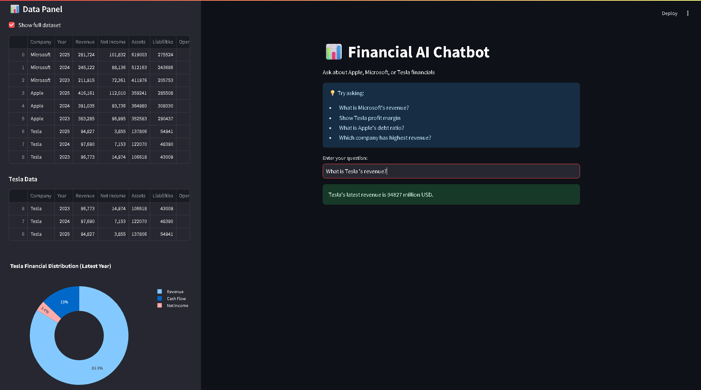

# 📊 Financial Insights Chatbot

A rule-based financial analysis chatbot developed as part of the **BCG X GenAI Work Simulation**. The application analyzes financial data from Apple, Microsoft, and Tesla and provides insights through a conversational interface.

## Features

- Revenue Analysis
- Net Income Analysis
- Profit Margin Calculation
- Debt Ratio Calculation
- Company Financial Comparison
- Interactive Data Visualization
- Rule-Based Query Processing
- CSV Data Retrieval
- Error Handling

## Data Preparation

### Data Cleaning
- Removed inconsistencies in financial records
- Validated dataset entries

### Data Transformation
- Standardized financial data formats
- Organized data for efficient retrieval

### Data Preprocessing

#### Feature Engineering
- Profit Margin (%)
- Debt Ratio

#### Data Encoding and Formatting
- Structured company financial records
- Prepared datasets for query-based retrieval

#### Time Series Data Handling
- Organized yearly financial data
- Enabled trend-based analysis

## Tech Stack

- Python
- Streamlit
- Pandas
- Plotly Express

## Project Structure

```text
├── Apple 10-k/
├── Microsoft 10-k/
├── Tesla 10-K/
├── DATA/
├── chatbot/
├── BCG.xlsx
├── BCG.csv
├── app.py
├── requirements.txt
└── README.md
```

## How It Works

1. User enters a financial query.
2. The chatbot identifies the company.
3. Relevant financial data is retrieved from the CSV dataset.
4. Financial KPIs are calculated when required.
5. Results are displayed with visual insights.

## Sample Queries

- What is Microsoft's revenue?
- Show Tesla profit margin
- What is Apple's debt ratio?
- Which company has the highest revenue?
- Show Tesla net income

## Installation

Clone the repository:

```bash
git clone https://github.com/tejonish/BCGX-Financial-Chatbot.git
cd BCGX-Financial-Chatbot
```

Install dependencies:

```bash
pip install -r requirements.txt
```

Run the application:

```bash
streamlit run app.py
```

## Learning Outcomes

- Financial Data Analysis
- Data Cleaning and Transformation
- Feature Engineering
- Time Series Data Handling
- Rule-Based Chatbot Development
- State Management
- Data Visualization using Plotly
- Streamlit Application Development

## Screenshots

### Apple Analysis


### Microsoft Analysis


### Tesla Analysis


## Author

**Nishanth B**

GitHub: https://github.com/tejonish

LinkedIn: https://www.linkedin.com/in/nishanth-b
